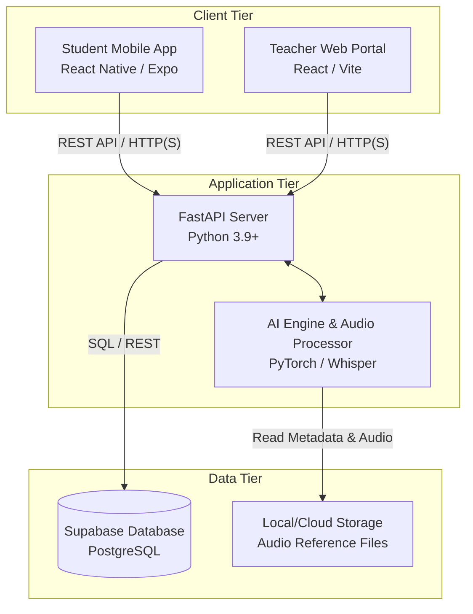

# TasmiqAI: Quran Recitation Expert System
**Project Report**

---

## CHAPTER 1. INTRODUCTION

### 1.1 Introduction
The preservation of the precise pronunciation of the Holy Quran is a fundamental practice in Islamic education. Tasmiq, the act of reciting the Quran from memory or text to a teacher, has traditionally required one-on-one sessions with expert Qaris (reciters). With the advancement of Artificial Intelligence, specifically in the domains of Automatic Speech Recognition (ASR) and expert systems, it is now possible to assist learners in their recitation practice. TasmiqAI is an AI-driven ecosystem designed to provide differential phonetic assessment and Makhraj (articulation point) analysis to assist students and teachers in the learning process.

### 1.2 Problem statement(s)
* **Subjectivity and Resource Constraints:** Traditional recitation assessment relies entirely on human experts, making it subjective and difficult to scale, especially in regions lacking qualified teachers.
* **Lack of Immediate Feedback:** Self-learners practicing at home often reinforce incorrect pronunciation because they do not have access to immediate, accurate phonetic correction.
* **Complex Makhraj Rules:** The subtle differences in Arabic articulation points (Makhraj) are difficult for non-native speakers to master without precise visual or differential guidance.

### 1.3 Objective
* To develop an intelligent backend system using transformer-based ASR models (e.g., Whisper, Wav2Vec2) to transcribe and analyze Arabic recitation phonetics.
* To create a sequence-matching algorithm that compares user recitation against expert reference audio to highlight phonetic differences.
* To design and implement user-friendly interfaces (Mobile App and Teacher Portal) that present the differential assessment and provide actionable Makhraj tips.

### 1.4 Scope
* **Target Users:** Quran students (both beginners and intermediate) and Quranic school educators.
* **Domain:** Arabic phonetic analysis, specifically focusing on Tajweed and Makhraj articulation accuracy.
* **Platform:** A FastAPI Python backend hosted on a server, a React Native (Expo) mobile application for students, and a React (Vite) web portal for teachers.
* **Limitations:** The system evaluates pronunciation and phonetics but does not dynamically assess melodic rules (Maqamat) or complex advanced Tajweed rules that require contextual grammatical understanding.

### 1.5 Project Significance
TasmiqAI significantly reduces the burden on human teachers by automating the preliminary phonetic assessment of students. It allows students to practice independently with immediate, actionable feedback, thereby accelerating their learning curve and improving their confidence before formal assessment.

### 1.6 Expected Output
The expected output is a fully functional software ecosystem encompassing:
1. A robust API capable of processing audio files and returning phonetic difference scores.
2. An interactive mobile app for students to select Surahs, listen to reference audio, record their recitation, and view visual feedback.
3. A web dashboard for teachers to monitor student progress and view automated assessments.

### 1.7 Conclusion
This chapter introduced the TasmiqAI project, outlining the core problems in traditional recitation learning and how an AI expert system can provide a scalable, immediate feedback solution. The objectives, scope, and significance set the foundation for the system's development.

---

## CHAPTER 2. LITERATURE REVIEW AND PROJECT METHODOLOGY

### 2.1 Introduction
This chapter discusses the domain of AI in language learning, reviews existing systems, details the chosen technological techniques, and outlines the methodology and requirements for developing TasmiqAI.

### 2.2 Facts and findings (based on topic)

#### 2.2.1 Domain
The project falls under Artificial Intelligence in Education (AIEd), specifically intersecting Expert Systems and Natural Language Processing (NLP). The core challenge is Arabic Automatic Speech Recognition (ASR), which requires models trained on highly stylized and rhythmic speech (Tajweed).

#### 2.2.2 Existing System
* **Traditional Methods:** Require physical presence, making it unscalable.
* **Existing Apps (e.g., Tarteel AI):** Tarteel utilizes voice recognition primarily for tracking memorization (Hifz) and identifying reading mistakes based on text matching. However, TasmiqAI introduces a novel *Differential Phonetic Assessment*, comparing the user's audio directly against an expert's reference audio phonetics rather than just text, allowing for finer Makhraj analysis.

#### 2.2.3 Technique
The project employs a pre-trained Whisper model (`tarteel-ai/whisper-base-ar-quran`) to transcribe both the expert reference audio and the user's audio into phonetics. The `difflib.SequenceMatcher` in Python is then used to compute the difference ratio and generate a color-coded HTML diff. Makhraj tips are generated by cross-referencing missed phonemes with a predefined Knowledge Base mapping characters to their articulation points.

### 2.3 Project Methodology
The project adopted the **Agile Software Development Life Cycle (SDLC)**. 
* **Planning & Requirements:** Identifying the need for distinct client apps (student vs. teacher) and a unified backend.
* **Iterative Prototyping:** Initially developing the AI logic using Python scripts in Visual Studio Code, followed by a Gradio UI (`tasmiq_app.py`) to validate the logic.
* **Development Sprints:** Decoupling the Gradio UI into a RESTful API (`tasmiq_api.py`) and concurrently building the React Native and React web frontends.
* **Continuous Integration:** Regular testing of the ASR pipeline with real audio samples.

### 2.4 Project Requirements

#### 2.4.1 Software Requirement
* **Backend:** Python 3.9+, FastAPI, PyTorch, Transformers, Librosa, Soundfile.
* **Database:** Supabase.
* **Frontend:** Node.js, Expo (React Native) for Mobile, Vite (React) for Web Portals, TailwindCSS for styling.
* **Tools:** Git, Visual Studio Code.

#### 2.4.2 Hardware Requirement
* **Development/Deployment Server:** GPU-enabled machine (NVIDIA CUDA support) for accelerated inference of transformer models.
* **Client Devices:** Standard Android/iOS smartphones and modern desktop web browsers.

#### 2.4.3 Other Requirements
* Quranic dataset comprising JSON metadata and reference MP3 audio files, extracted from previous research on GitHub.
* AI speech recognition engine sourced from existing GitHub repositories.

### 2.5 Project Schedule and Milestones
1. **Phase 1:** Dataset acquisition from GitHub and baseline ASR model testing in Visual Studio Code.
2. **Phase 2:** Development of the differential analysis algorithm and Gradio Prototype.
3. **Phase 3:** API development (FastAPI) and model integration.
4. **Phase 4:** Frontend development (Mobile app and Teacher Portal).
5. **Phase 5:** System integration, testing, and documentation.

### 2.6 Conclusion
The review of existing systems highlights the need for phonetic-level feedback. The chosen Agile methodology and modern software stack ensure the system can be developed iteratively and scaled efficiently.

---

## CHAPTER 3. ANALYSIS

### 3.1 Introduction
This chapter delves into the specific requirements of the TasmiqAI system, analyzing the data, functional, and non-functional aspects necessary for successful implementation.

### 3.2 Problem Analysis
Currently, a student listens to an audio track, attempts to replicate it, and has no way to objectively measure their accuracy. The system must intake the user's audio, dynamically load the corresponding expert audio based on the Surah and Ayah selected, process both through the ASR pipeline, and return a quantifiable comparison. The challenge lies in ensuring the transcription is fast enough for real-time feedback and accurate enough to be trusted.

### 3.3 Requirement analysis

#### 3.3.1 Data Requirement
* **Input Data:** User's recorded audio (WAV/WebM formats), target Surah index, and target Ayah number.
* **Internal Storage/Reference Data:** A structured repository of Quranic data extracted from previous research on GitHub, including metadata (surah.json) and segmented expert audio files (e.g., `audio/001/001.mp3`).
* **Output Data:** A calculated percentage score, color-coded phonetic difference strings, and text-based Makhraj correction tips.

#### 3.3.2 Functional Requirement
* The system shall allow users to select specific Surahs and Ayahs.
* The system shall play reference audio for the selected Ayah.
* The system shall record user audio via the device microphone.
* The backend shall process the audio, trim silence, and normalize volume.
* The backend shall perform speech-to-text to generate phonetics.
* The system shall generate a comparative visual diff highlighting insertions, deletions, and replacements.

#### 3.3.3 Non-functional Requirement
* **Performance:** The API response time for audio assessment should ideally be under 5 seconds to maintain user engagement.
* **Accuracy:** The ASR transcription should be highly resilient to background noise.
* **Usability:** The UI must be intuitive, particularly the mobile app designed for students of varying ages.

#### 3.3.4 Others Requirement
* Requires FFmpeg binaries installed on the server environment to decode various web audio formats from mobile clients.

### 3.4 Conclusion
The analysis phase defines clear boundaries for data flow and system capabilities, ensuring that the development phase focuses on processing audio efficiently and delivering accurate phonetic comparisons.

---

## CHAPTER 4. DESIGN

### 4.1 Introduction
This chapter outlines the high-level architecture, user interface considerations, and the detailed algorithmic design of the TasmiqAI backend.

### 4.2 High-Level Design

#### 4.2.1 System Architecture
TasmiqAI utilizes a **Three-Tier Client-Server Architecture**:
1. **Presentation Tier:** Comprises the React Native Mobile App (Student) and React Web Portal (Teacher).
2. **Application Tier:** The FastAPI server that handles HTTP requests, CORS, audio file temp storage, and orchestrates the inference.
3. **Data/AI Tier:** The PyTorch/Transformers engine running Whisper models, alongside the local filesystem serving the Quran JSON dataset and reference MP3s.

#### 4.2.2 User Interface Design
* **Navigation Design:** 
  - *Mobile:* Dashboard -> Surah Selection -> Recitation Interface -> Results Modal.
  - *Web:* Teacher Login -> Class Overview -> Student Detail -> Audio Playback & Assessment History.
* **Input Design:** Use of native recording APIs to capture audio; dropdowns and numeric inputs for Surah/Ayah selection.

#### 4.2.3 Database Design
Currently, the system uses a flat-file database approach for Quranic content extracted from GitHub, utilizing a structured folder hierarchy (`source/audio/SURAH/AYAH.mp3` and `source/surah/surah_N.json`). Supabase is implemented as the primary database tool to store `UserProfiles`, `RecitationSessions`, `AssessmentScores`, and teacher feedback.

### 4.3 Detailed Design

#### 4.3.1 Software Design
The core assessment algorithm (`assess_recitation`) follows this logic flow:
1. **Input:** `surah_id`, `ayah_id`, `user_audio_file`.
2. **Audio Processing (`process_audio`):** Reads the file, resamples to 16kHz, trims leading/trailing silence (top_db=25), and normalizes the waveform array.
3. **Inference (`get_phonetics`):** Passes the array through the Hugging Face pipeline.
4. **Reference Retrieval:** Loads and processes the corresponding expert MP3.
5. **Comparison (`generate_diff_html`):** Uses `difflib.SequenceMatcher` to find matching blocks. Generates HTML spans with green for matches and red for errors.
6. **Makhraj Mapping (`get_makhraj_tips`):** Extracts missing characters from the diff, looks them up in the `MAKHRAJ_MAP` dictionary, and appends rule-based tips.

#### 4.3.2 Physical Database Design
* File system organization: The Quran JSON dataset is strictly organized into `audio`, `surah`, `tajweed`, and `translation` directories to allow dynamic, index-based querying in Python.

### 4.4 Conclusion
The modular architecture ensures that the heavy AI processing is decoupled from the frontend clients, allowing for scalable deployment and a responsive user experience.

---

## CHAPTER 5. IMPLEMENTATION

### 5.1 Introduction
This chapter details the transition from the system design phase into the physical development of TasmiqAI. It covers the setup of the development environments, the hardware and software architecture, configuration management, version control strategies, and the current implementation status of each core module.

### 5.2 Software Development Environment Setup
The development environment is structured around a decoupled, three-tier architecture ensuring scalability and ease of deployment.

#### 5.2.1 Deployment and Environment Architecture
The architecture consists of the client-side applications (Mobile App and Web Portal), a cloud-hosted Supabase database, and a high-performance backend processing server equipped with GPU capabilities for AI inference. 

Below is the deployment diagram representing the physical hardware, software servers, and their network connections:

#### 5.2.2 Hardware and Network Setup
* **Backend Inference Server:** A dedicated machine or cloud instance equipped with an NVIDIA GPU (CUDA support) is required to ensure low-latency processing of the Hugging Face Whisper ASR model. It operates on port `8000` to serve API requests.
* **Database (Supabase):** Hosted externally as a cloud service, accessed securely via API keys. It handles relational data (Users, Scores, Sessions).
* **Client Devices:** Students utilize Android or iOS smartphones, while teachers access the system via standard desktop or laptop web browsers over an internet connection.

#### 5.2.3 Software Configuration
* **Backend:** Configured within Visual Studio Code. A Python virtual environment (`venv`) isolates dependencies such as `fastapi`, `torch`, `transformers`, and `librosa`. FFmpeg is explicitly installed in the system PATH to allow audio codec conversions.
* **Frontend:** Built using Node.js. The mobile application utilizes the Expo CLI for rapid testing on physical devices, while the web portal uses Vite for optimized Hot Module Replacement (HMR) during development.

### 5.3 Software Configuration Management

#### 5.3.1 Configuration Environment Setup
The project follows a monorepo-style logical structure, divided into distinct modular directories to allow independent team development and testing:
* `tasmiq_api.py` / `tasmiq_app.py` – Core AI logic and FastAPI backend.
* `tasmiq-mobile/` – Student Expo application.
* `tasmiq-teacher-portal/` – React Vite web portal.
* `deps/` – External binaries and dependencies (e.g., FFmpeg).

#### 5.3.2 Version Control Procedure
Git is utilized as the primary version control system. 
* **Repository Hosting:** GitHub is used to host the source code, track issues, and manage feature branches.
* **Branching Strategy:** A feature-branch workflow is applied. New modules (e.g., UI changes, API endpoints) are developed on separate branches and merged into the `main` branch upon successful local testing.
* **Exclusion Policies:** Strict `.gitignore` files are implemented across directories to prevent the upload of heavy machine learning model weights, large audio datasets (reference MP3 files), and generated dependency folders (`node_modules`, `__pycache__`).

### 5.4 Implementation Status
The system was divided into several modules. The current status of development is documented below:

| Module Name | Description | Duration | Date Completed | Status |
| :--- | :--- | :--- | :--- | :--- |
| **Speech Recognition Engine** | Integration of the AI speech recognition model sourced from GitHub to transcribe Arabic phonetics accurately. | 3 Weeks | TBD | 100% Completed |
| **Phonetic Expert System** | Implementation of sequence-matching logic (`difflib`) to compare user phonetics against reference audio and map to Makhraj tips. | 2 Weeks | TBD | 100% Completed |
| **FastAPI Backend** | Development of REST API endpoints capable of receiving multipart form audio files, routing them to the AI engine, and returning JSON feedback. | 2 Weeks | TBD | 100% Completed |
| **Student Mobile Application** | React Native interface allowing users to select Surahs, record recitation, and view color-coded differential feedback. | 4 Weeks | In Progress | 70% Completed |
| **Teacher Web Portal** | React interface for educators to monitor student performance, view historical scores, and provide manual feedback. | 3 Weeks | In Progress | 50% Completed |
| **Supabase Integration** | Establishing the cloud database schema and linking it to the backend and frontend for persistent data storage. | 2 Weeks | In Progress | 60% Completed |

*(Note: The 'Date Completed' fields will be finalized upon the conclusion of User Acceptance Testing).*

### 5.5 Conclusion
This chapter detailed the physical realization of the TasmiqAI system. By utilizing modern development frameworks like Visual Studio Code, FastAPI, React Native, and Supabase, alongside a strict Git version control procedure, the project maintains a stable and scalable environment. The backend AI infrastructure is fully operational, and frontend integration is steadily progressing toward completion.

---

## CHAPTER 6. TESTING

### 6.1 Introduction
Testing ensures the reliability of the audio processing pipeline and the accuracy of the phonetic assessments provided by the AI model.

### 6.2 Test Plan

#### 6.2.1 Test Organization
Testing was conducted primarily by the developer using a mix of automated scripts (`test_post.py`, `test_cpu.py`) and manual functional testing via the Gradio interface.

#### 6.2.2 Test Environment
Testing was carried out on a Windows environment utilizing an NVIDIA GPU for fast inference. Mobile endpoints were tested using Postman and the Expo Go client.

#### 6.2.3 Test Schedule
Testing occurred continuously alongside development, with a specific focus on API payload testing after the transition from Gradio to FastAPI.

### 6.3 Test Strategy
A bottom-up approach was utilized. First, unit tests verified the `process_audio` function could handle different formats. Then, the `get_phonetics` inference was tested. Finally, the FastAPI endpoint was tested as a black box.

#### 6.3.1 Classes of tests
* **Functionality Test:** Ensuring the correct reference audio is fetched based on Surah/Ayah inputs.
* **Accuracy Test:** Comparing the ASR output against known good recitations.
* **Integration Test:** Sending a `.wav` file via a `multipart/form-data` POST request (`test_post.py`) to ensure the FastAPI server processes it and returns JSON without crashing.

### 6.4 Test Design

#### 6.4.1 Test Description
A standard test case involves uploading `test_user.mp3` or `user_rec.wav` with a specific Surah and Ayah index. The expected result is a JSON response containing a numeric score, HTML feedback, and Makhraj tips.

#### 6.4.2 Test Data
Synthetic test files and actual user recordings (`test.wav`, `test_user.mp3`) were placed in the root directory to validate pipeline robustness against varying bitrates and noise levels.

### 6.5 Test Results and Analysis
The FastAPI backend successfully handled requests. The use of Whisper models proved highly accurate for clear audio, though performance degrades if the microphone is too far or ambient noise is high. The differential algorithm successfully highlighted errors and triggered appropriate Makhraj tips.

### 6.6 Conclusion
Testing validated the core functionality and API integration, proving the system is robust enough for deployment and frontend integration.

---

## CHAPTER 7. CONCLUSION

### 7.1 Observation on Weaknesses and Strengths
* **Strengths:** 
  - Completely automates the initial assessment phase.
  - The differential sequence matcher provides highly specific visual feedback, making it easier for visual learners to spot mistakes.
  - The mapping of missed phonemes to detailed Makhraj instructions is a unique, highly pedagogical feature.
* **Weaknesses:**
  - AI inference requires significant compute power (GPU) for low-latency responses, making server hosting more expensive.
  - Whisper models, while robust, can occasionally hallucinate transcriptions if the audio contains long pauses or heavy echo.

### 7.2 Propositions for Improvement
* **Real-time Streaming:** Implementing WebSockets to stream audio to the server and receive continuous feedback, rather than requiring the user to record the whole Ayah first.
* **Advanced Tajweed Rules:** Enhancing the AI to detect specific durations (Madd) and nasal sounds (Ghunnah) beyond just base phonetics.
* **Enhanced Database Analytics:** Further expanding the Supabase integration to provide deeper historical analytics and comprehensive reporting to the Teacher Portal.

### 7.3 Project Contribution
TasmiqAI contributes significantly to educational technology by providing an accessible, intelligent tool for Quranic studies. It empowers students with independent learning capabilities and equips educational institutions with automated assessment tools to track overall class performance.

### 7.4 Conclusion
TasmiqAI successfully demonstrates the application of modern transformer-based AI models in specialized phonetic assessment. By meeting its core objectives, the project provides a strong foundation for a comprehensive, cross-platform educational ecosystem.
