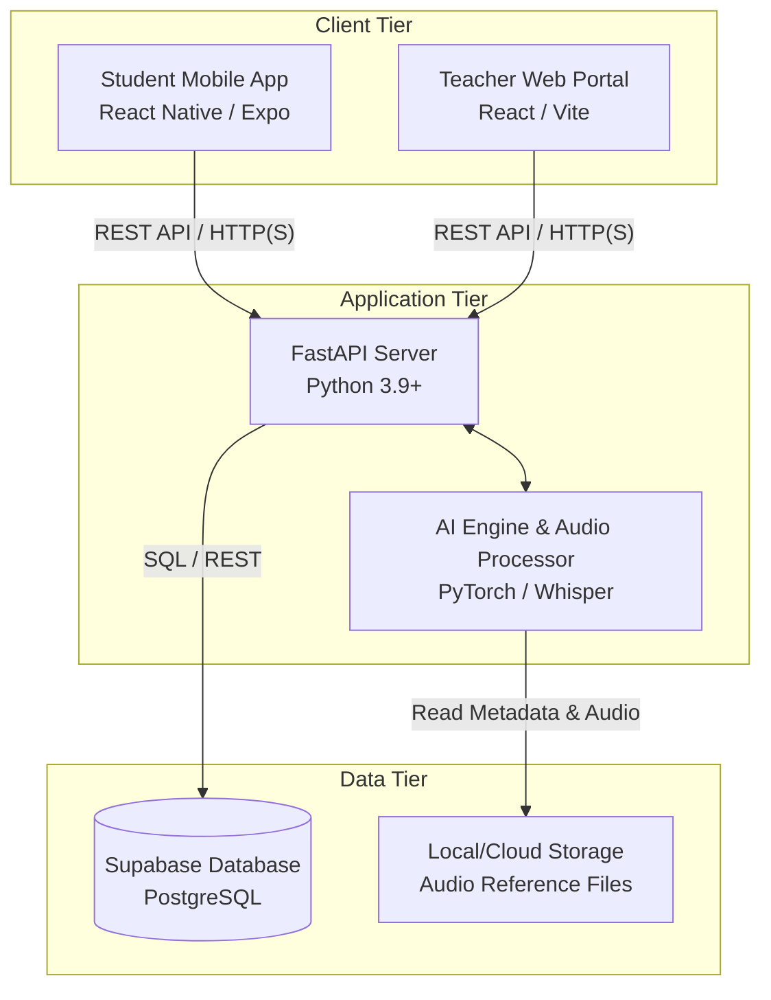

## CHAPTER 5. IMPLEMENTATION

### 5.1 Introduction
This chapter details the transition from the system design phase into the physical development of TasmiqAI. It covers the setup of the development environments, the hardware and software architecture, configuration management, version control strategies, and the current implementation status of each core module.

### 5.2 Software Development Environment Setup
The development environment is structured around a decoupled, three-tier architecture ensuring scalability and ease of deployment.

#### 5.2.1 Deployment and Environment Architecture
The architecture consists of the client-side applications (Mobile App and Web Portal), a cloud-hosted Supabase database, and a high-performance backend processing server equipped with GPU capabilities for AI inference. 

Below is the deployment diagram representing the physical hardware, software servers, and their network connections:

#### 5.2.2 Hardware and Network Setup
* **Backend Inference Server:** A dedicated machine or cloud instance equipped with an NVIDIA GPU (CUDA support) is required to ensure low-latency processing of the Hugging Face Whisper ASR model. It operates on port `8000` to serve API requests.
* **Database (Supabase):** Hosted externally as a cloud service, accessed securely via API keys. It handles relational data (Users, Scores, Sessions).
* **Client Devices:** Students utilize Android or iOS smartphones, while teachers access the system via standard desktop or laptop web browsers over an internet connection.

#### 5.2.3 Software Configuration
* **Backend:** Configured within Visual Studio Code. A Python virtual environment (`venv`) isolates dependencies such as `fastapi`, `torch`, `transformers`, and `librosa`. FFmpeg is explicitly installed in the system PATH to allow audio codec conversions.
* **Frontend:** Built using Node.js. The mobile application utilizes the Expo CLI for rapid testing on physical devices, while the web portal uses Vite for optimized Hot Module Replacement (HMR) during development.

### 5.3 Software Configuration Management

#### 5.3.1 Configuration Environment Setup
The project follows a monorepo-style logical structure, divided into distinct modular directories to allow independent team development and testing:
* `tasmiq_api.py` / `tasmiq_app.py` – Core AI logic and FastAPI backend.
* `tasmiq-mobile/` – Student Expo application.
* `tasmiq-teacher-portal/` – React Vite web portal.
* `deps/` – External binaries and dependencies (e.g., FFmpeg).

#### 5.3.2 Version Control Procedure
Git is utilized as the primary version control system. 
* **Repository Hosting:** GitHub is used to host the source code, track issues, and manage feature branches.
* **Branching Strategy:** A feature-branch workflow is applied. New modules (e.g., UI changes, API endpoints) are developed on separate branches and merged into the `main` branch upon successful local testing.
* **Exclusion Policies:** Strict `.gitignore` files are implemented across directories to prevent the upload of heavy machine learning model weights, large audio datasets (reference MP3 files), and generated dependency folders (`node_modules`, `__pycache__`).

### 5.4 Implementation Status
The system was divided into several modules. The current status of development is documented below:

| Module Name | Description | Duration | Date Completed | Status |
| :--- | :--- | :--- | :--- | :--- |
| **Speech Recognition Engine** | Integration of the AI speech recognition model sourced from GitHub to transcribe Arabic phonetics accurately. | 3 Weeks | TBD | 100% Completed |
| **Phonetic Expert System** | Implementation of sequence-matching logic (`difflib`) to compare user phonetics against reference audio and map to Makhraj tips. | 2 Weeks | TBD | 100% Completed |
| **FastAPI Backend** | Development of REST API endpoints capable of receiving multipart form audio files, routing them to the AI engine, and returning JSON feedback. | 2 Weeks | TBD | 100% Completed |
| **Student Mobile Application** | React Native interface allowing users to select Surahs, record recitation, and view color-coded differential feedback. | 4 Weeks | In Progress | 70% Completed |
| **Teacher Web Portal** | React interface for educators to monitor student performance, view historical scores, and provide manual feedback. | 3 Weeks | In Progress | 50% Completed |
| **Supabase Integration** | Establishing the cloud database schema and linking it to the backend and frontend for persistent data storage. | 2 Weeks | In Progress | 60% Completed |

*(Note: The 'Date Completed' fields will be finalized upon the conclusion of User Acceptance Testing).*

### 5.5 Conclusion
This chapter detailed the physical realization of the TasmiqAI system. By utilizing modern development frameworks like Visual Studio Code, FastAPI, React Native, and Supabase, alongside a strict Git version control procedure, the project maintains a stable and scalable environment. The backend AI infrastructure is fully operational, and frontend integration is steadily progressing toward completion.
