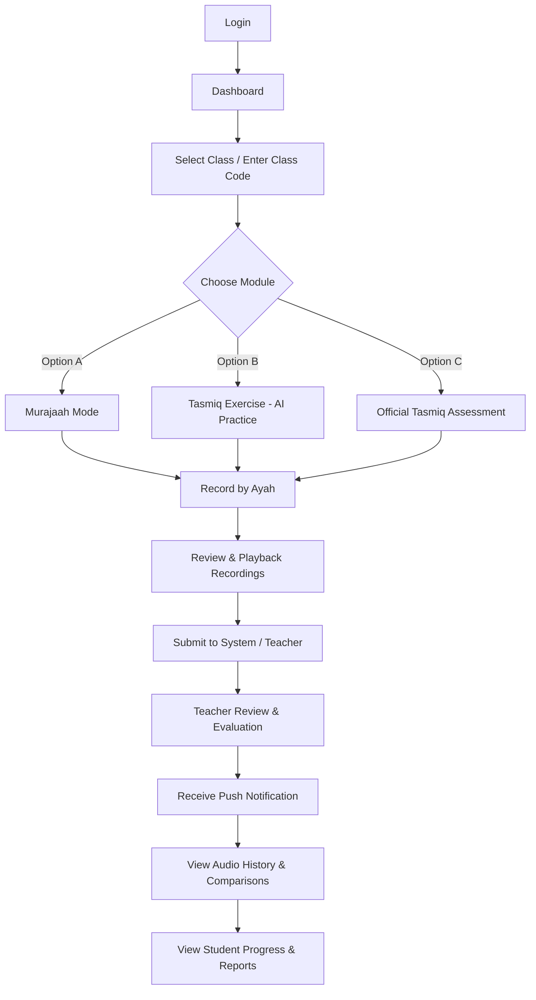
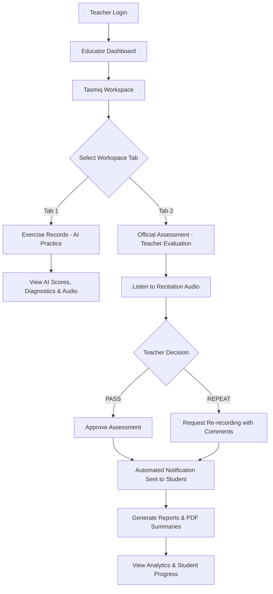

# TasmiqAI System Flow Diagrams

This document contains the professional system flow diagrams for the **Student Mobile Application** and **Teacher Web Portal**.

---

## 1. Student Mobile Application Flow

---

## 2. Teacher Web Portal Flow

---

## Summary of Flow Enhancements

1. **Auto-Join Class**: Enrollment approval steps have been removed. Valid class codes enroll students directly.
2. **Ayah-by-Ayah Recording**: Recitations are recorded and evaluated individually per ayah, providing precise audio playback controls (Play, Pause, Replay, Loop, and Sequential Playback).
3. **Teacher Decision Flow**: The teacher workspace explicitly separates AI Practice Exercises from Official Teacher Assessments (where AI percentage is hidden and teachers decide PASS or REPEAT with instant student notifications).
